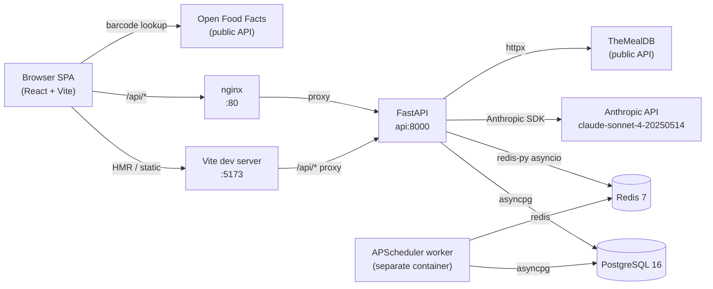

# Architecture

A working tour of the codebase as it stands today. This is the doc to read after `onboarding.md` — it should give you enough mental model to find your way to whatever you're changing. The bottom half ("Scalability path", "Security considerations", "Trade-offs and decisions") is the longer-form rationale that originated as `ARCHITECTURE.md` and has been preserved here.

---

## Table of contents

1. [High-level system](#high-level-system)
2. [Backend architecture](#backend-architecture)
3. [Frontend architecture](#frontend-architecture)
4. [Data layer](#data-layer)
5. [Auth model (current)](#auth-model-current)
6. [Background work](#background-work)
7. [CI/CD overview](#cicd-overview)
8. [Data flow diagrams](#data-flow-diagrams)
9. [Database schema (SQL)](#database-schema-sql)
10. [Scalability path](#scalability-path)
11. [Security considerations](#security-considerations)
12. [Trade-offs and decisions](#trade-offs-and-decisions)

---

## High-level system



A few things worth noting:

- The frontend talks to **two different paths** in dev. Vite owns `:5173` (HMR + static); nginx owns `:80` and proxies `/api/*` to FastAPI. Vite's dev server has its own `/api → :8000` proxy block, so either entry point reaches the same API.
- The worker is a **separate container** running `python -m app.workers.expiry_worker`. It shares the same Python package and DB schema as the API but runs the APScheduler loop, not the HTTP server.
- **Open Food Facts is called from the browser**, not the backend. Barcode scanning uses ZXing in JS, then fetches the product from OFF directly. There's no backend wrapper.
- **Anthropic is called from the backend only.** The frontend posts to `/api/v1/recipes/rescue` and the backend makes the upstream call. The API key never reaches the browser.
- **TheMealDB** powers the legacy "Recipe Suggestions" endpoint (`/households/{id}/recipes`). It's distinct from Rescue Recipes — see the [Recipes — two flavours](#recipes--two-flavours) section.

---

## Backend architecture

### Layered architecture

The backend follows a strict layering. Don't skip layers.

```
api/v1/routes/*.py     ← HTTP — auth deps, validation, response shaping
        ↓
services/*.py          ← Business logic, transactions, auth checks, domain errors
        ↓
repositories/*.py      ← SQL only. No HTTP, no business logic. Returns ORM models.
        ↓
models/*.py            ← SQLAlchemy 2 ORM mappings.
```

Cross-cutting:

| Module | Role |
|--------|------|
| `app/schemas/*.py` | Pydantic v2 request/response models. Routes consume + return these. |
| `app/api/v1/dependencies.py` | `get_current_user`, `require_household_member` — composed via `Depends(...)`. |
| `app/database.py` | `Base`, async `engine`, `AsyncSessionLocal`, `get_db()` async generator. |
| `app/config.py` | `Settings` class (pydantic-settings). All env vars live here. |
| `app/main.py` | App factory, middleware, lifespan, router registration. |

### How a request flows

For `POST /api/v1/households/{id}/items`:

1. **Nginx** (or Vite proxy in Path B) receives the request, forwards to `api:8000`.
2. **`main.py` middleware chain** runs:
   - **Correlation-ID middleware** — picks up `X-Correlation-ID` from header or generates a UUID, binds it to structlog contextvars, echoes it back in the response.
   - **Rate-limit middleware** — sliding window via Redis `INCR`/`EXPIRE`, keyed by client IP. Bypasses health/docs paths. Fails open if Redis is down.
3. **Route** in `app/api/v1/routes/items.py` runs the dependency chain:
   - `Depends(get_current_user)` decodes the access JWT and loads the user via `AuthService`.
   - `Depends(require_household_member)` checks `household_members` and 403s if not a member.
   - `Depends(get_db)` yields an `AsyncSession`.
4. The route calls **`ItemService(db).add_item(...)`** with the validated `ItemCreate` schema.
5. The service calls into **`ItemRepository`** for the SQL (`find_duplicate`, `create`, `update`).
6. The service returns an `ItemResponse` (Pydantic) which FastAPI serialises.
7. The **global exception handler** (`@app.exception_handler(Exception)`) catches anything unhandled and returns a 500 with `{"detail": "Internal server error"}` rather than leaking a stack trace.

### Where new things go

| You're adding… | Touch these |
|----------------|-------------|
| A new resource (e.g. shopping lists) | `models/`, `repositories/`, `services/`, `schemas/`, `api/v1/routes/`, register the router in `main.py`, write a new Alembic migration. |
| A new field on an existing model | `models/<x>.py`, the Pydantic schemas in `schemas/<x>.py`, a new Alembic migration, repository updates if it filters/sorts by the field. |
| A new endpoint on an existing resource | Route + service method + schema. Repository may already have what you need. |
| A background job | A new job in `app/workers/expiry_worker.py` (or a new file in `workers/`). Register the schedule in the worker's `main()`. |
| An external HTTP call | Wrap it in a service method. Use `httpx.AsyncClient` with an explicit timeout. Don't fail the user request on upstream 5xx — degrade. |

### Conventions

- **One service class per resource**, instantiated with `db` per request. State lives on `self.db`/`self.<repo>`.
- **Repositories take `db: AsyncSession`** in `__init__`, return ORM objects or primitives. Never raise `HTTPException`.
- **Services raise domain errors** like `AuthError`, `HouseholdError`. Routes translate those to `HTTPException`. See `routes/auth.py` and `routes/households.py` for the pattern.
- **Routes are thin**: deps + service call + (sometimes) response shaping. The grouping logic in `items.list_items` is borderline — it lives in the route because it touches the response shape, not the data layer.
- **Soft-delete on `pantry_items`**: every item query must filter `deleted_at IS NULL`. Repository helpers do this; partial indexes back it.
- **Use `selectinload` for collections**, `joinedload` for to-one. Don't trigger lazy loads inside an async session — they'll error.
- **Logging via structlog** with snake_case dot-namespaced events: `logger.info("household.created", household_id=...)`. Never log secrets, tokens, or full bodies.

### Adding a route — the recipe

1. **Schema** in `schemas/<resource>.py` — `XxxCreate`, `XxxUpdate`, `XxxResponse`. Use `Field(..., description=...)` for OpenAPI hints.
2. **Repository method** in `repositories/<resource>_repository.py`. Pure data access; takes `db: AsyncSession`.
3. **Service method** in `services/<resource>_service.py` — orchestrates repos, enforces auth/business rules, raises a domain error.
4. **Route** in `api/v1/routes/<resource>.py`. Use `response_model=`. Compose deps. Translate domain errors.
5. **Test** in `tests/test_<resource>.py`. At least one happy-path + one auth/permission failure.

### Error handling

| Error type | Where raised | Translated by |
|-----------|--------------|---------------|
| `AuthError` | `AuthService` | `routes/auth.py` → 401/409 |
| `HouseholdError` | `HouseholdService` | `routes/households.py` → 400/403/404 |
| `HTTPException` | routes, `rescue_recipe_service.py` | FastAPI default |
| Pydantic `ValidationError` | request body parsing | FastAPI default → 422 |
| Anything else | global handler in `main.py` | → 500 with generic body, full trace logged |

`rescue_recipe_service.suggest_rescue_recipes` is the one place `HTTPException` is raised inside a service rather than translated at the route. That's intentional — its error matrix (403/400/502/503) is tightly coupled to the orchestration logic.

### Recipes — two flavours

There are two distinct recipe code paths, both mounted under `/api/v1`:

| Path | Source | Service | Notes |
|------|--------|---------|-------|
| `GET /households/{id}/recipes` | TheMealDB (free public API) | `RecipeService` | Fetches by ingredient via `httpx.AsyncClient` (5s timeout), scores by overlap, returns top 10. Falls back to a hard-coded list if the API errors. |
| `POST /recipes/rescue` | Anthropic (`claude-sonnet-4-20250514`) | `rescue_recipe_service` | Requires 3+ items expiring within 3 days. Caches the response in Redis for 10 min keyed by `rescue_recipes:{household_id}:{hash_of_sorted_item_ids}`. |

Both routers are wired into `routes/recipes.py` and exposed via the same `recipes` tag in OpenAPI.

---

## Frontend architecture

### Layered architecture

```
pages/*.tsx                ← route components, layout assembly
        ↓ uses
hooks/use<Resource>.ts     ← TanStack Query hook, returns { data, isLoading, mutations }
        ↓ calls
api/<resource>.ts          ← typed axios call
        ↓ via
api/client.ts              ← axios instance with auth header + 401-refresh interceptor
        ↓
                             FastAPI at /api/v1/...
```

Cross-cutting:

| Module | Role |
|--------|------|
| `contexts/AuthContext` | User state, token storage, `queryClient.clear()` on session change. The only place that mutates token storage. |
| `components/ui/*` | Design-system primitives (Button, Input, Card, Badge, Modal, EmptyState, …). |
| `components/<domain>/*` | Feature components. `<domain>` ∈ `items`, `households`, `layout`. |
| `utils/*.ts` | Pure helpers. No React, no I/O. |
| `types/index.ts` | Shared TS types, mirrors backend Pydantic schemas. |

### Routing

`App.tsx` defines the route tree:

```
/                            LandingPage             (public)
/login, /register            auth pages              (public)
/join/:token                 JoinPage                (auth required, asks for confirmation)
/app/*                       Layout-wrapped routes   (auth required)
  /app/dashboard             DashboardPage
  /app/add-item              AddItemPage
  /app/households            HouseholdPage
  /app/recipes               RecipesPage
  /app/settings              SettingsPage
*                            redirect → /
```

The `/app/*` segment is load-bearing — adding an authenticated page means adding a child route inside the inner `<Routes>`, not a top-level one. Forgetting the prefix means the page renders without `Layout` (sidebar/bottom-tab nav).

### Where new things go

| You're adding… | Touch these |
|----------------|-------------|
| A new page | `src/pages/<X>Page.tsx`, register the route in `src/App.tsx` (under `/app/*` if auth-required). |
| A new resource fetch | `src/api/<resource>.ts`, `src/hooks/use<Resource>.ts`, types in `src/types/index.ts`. |
| A new UI primitive | `src/components/ui/<Name>.tsx`. Tokens via Tailwind utilities, support `className` passthrough, set `displayName` if forwarding refs. |
| A new feature component | `src/components/<domain>/<Name>.tsx`. |
| A new util | `src/utils/<purpose>.ts`. Pure functions only. |
| A new icon | Import from `lucide-react`. Never use emoji as icons. |

### TanStack Query conventions

- **One hook file per resource**. Query keys are tuples scoped by resource id: `['items', householdId]`.
- **Render every state**: `isLoading` (spinner/skeleton), `isError` (with retry calling `refetch`), empty (`<EmptyState />`), data.
- **Mutations** disable the submit button while `isPending` and surface `onError` inline (use `error` on `<Input>` for field errors).
- **Optimistic updates** follow the snapshot/rollback pattern in `useDeleteItem` (`hooks/useItems.ts`): `onMutate` snapshots, `onError` restores, `onSettled` invalidates.
- **`AuthContext` calls `queryClient.clear()`** on login/register/logout. Any query keyed without a user id implicitly relies on this — defence in depth is to include the user id in the key.

### Auth + tokens

- Tokens live in `localStorage` under literal keys `access_token` and `refresh_token` (defined in `src/api/client.ts`). Don't read/write them from outside `AuthContext` and the axios client.
- The axios response interceptor catches 401, attempts a single refresh, retries once. Concurrent in-flight requests queue on a shared promise (`pendingQueue`) so a refresh isn't fired N times. On a second 401 → tokens cleared + hard redirect to `/login`.
- `useAuth()` returns `{ user, isAuthenticated, isLoading, login, register, logout }`.
- `ProtectedRoute` in `App.tsx` gates `/app/*` and `/join/:token`.

### Design system

The single source of truth is `design-system/fridgecheck/MASTER.md`. Read it before any visual change. Hard rules:

- No raw hex outside `<svg>` blocks. Tokens via Tailwind utilities (`text-primary`, `bg-surface`, `bg-expiry-danger`, …).
- No emoji as icons. `lucide-react` only.
- Focus rings via `focus-visible:` (keyboard-only), ring colour `ring-primary/20`.
- Hover lifts use `translateY(-2px)`, never `scale()`.
- Respect `prefers-reduced-motion` (handled globally in `src/index.css`).
- Test mentally at 375 / 768 / 1024 / 1440 widths.

### Common gotchas

- `/households/{id}/items` returns a grouped object, not a flat array. `itemsApi.list` flattens it. If you change the backend shape, update the wrapper.
- HMR doesn't pick up new deps automatically. Install inside the container and restart Vite.
- Tailwind purges aggressively. Class names built dynamically (`bg-${color}-500`) won't survive purge — use full names or add to `safelist`.
- `/join/:token` asks for confirmation. Don't restore the previous auto-join behaviour — there's a real bug it caused (cross-account membership leak).
- The frontend has a `householdsApi.rename` calling `PATCH /households/{id}` but **no matching backend route exists** today. Calling it 405s. TODO(verify) whether this is dead code or a backend route is missing.

---

## Data layer

### Schema overview

| Table | PK | Notes |
|-------|----|-------|
| `users` | UUID | `email` and `username` unique. `is_active`, `is_verified` booleans. `hashed_password` is bcrypt. |
| `households` | UUID | `invite_token` 64-char unique. |
| `household_members` | UUID | `(household_id, user_id)` unique. `role` ∈ `owner`, `member`. Cascade-deletes from both parents. |
| `pantry_items` | UUID | FK to `households` (cascade), FK to `users` via `added_by` (set null). `category` ∈ 12-value enum. **Soft-delete via `deleted_at`** + partial indexes on `WHERE deleted_at IS NULL`. |
| `notification_preferences` | UUID | One per user (FK unique). `days_before_expiry` is a JSON list of ints, default `[1, 3]`. `email_enabled` boolean. |
| `refresh_tokens` | UUID | `token` unique. `expires_at`, `revoked_at`. Cascade-deletes from `users`. |

The `users.notification_preference` row is **not** auto-created on register today. **TODO(verify)**: the root `CLAUDE.md` says it is, but `AuthService.register` (`backend/app/services/auth_service.py`) only creates the user and stores a refresh token. Either this is a bug or the doc is out of date.

### Migrations workflow

```bash
# Generate (autogenerate diff against models)
docker compose exec api alembic revision --autogenerate -m "add foo to bar"

# Review the generated file. Autogenerate doesn't catch:
#   - enum value additions      → write op.execute("ALTER TYPE ... ADD VALUE 'baz'")
#   - server-default changes
#   - check constraints

# Apply
docker compose exec api alembic upgrade head

# Roll back one
docker compose exec api alembic downgrade -1
```

Migration rules:

1. **Never edit `0001_initial.py`** after the first deploy. New schema = new migration.
2. **Enum types are pre-created via raw SQL** in `0001_initial.py`. Columns reference them with `postgresql.ENUM(..., create_type=False)`. To add a value: write a new migration with `op.execute("ALTER TYPE foo_enum ADD VALUE 'bar'")`. PostgreSQL doesn't support cleanly removing enum values.
3. **Alembic env converts `postgresql://` → `postgresql+asyncpg://`** in `migrations/env.py` and runs migrations on the async engine. Don't change this without auditing every existing migration.
4. **The env also escapes `%` → `%%`** in the URL because configparser's `BasicInterpolation` chokes on percent-encoded password characters.

### Indexes

Notable beyond PKs and FKs:

- `pantry_items.expiry_date` (regular + partial-on-active)
- `pantry_items.household_id` (regular + partial-on-active)
- `users.email` (unique)
- `households.invite_token` (unique)
- `refresh_tokens.token` (unique)

The two `_active` partial indexes on `pantry_items` (where `deleted_at IS NULL`) are the right ones for any "current pantry" query.

---

## Auth model (current)

> **⚠ This is being migrated.** The current implementation stores tokens in browser `localStorage`. The team intends to move access tokens to memory + refresh tokens to httpOnly cookies (the existing `ARCHITECTURE.md` security section flagged this as future work). Don't sink time into hardening the localStorage path. **TODO(verify)** the timeline / who owns this migration.

### Today's flow

1. **Register** — `POST /api/v1/auth/register` validates email/username uniqueness, bcrypt-hashes the password, creates a `User`, stores a refresh token in `refresh_tokens`, returns `{access_token, refresh_token, token_type}`.
2. **Login** — `POST /api/v1/auth/login` verifies bcrypt password, checks `is_active`, returns the same token shape.
3. **Refresh** — `POST /api/v1/auth/refresh` swaps a refresh token for a new pair. The old refresh token is **revoked** in the same transaction (rotation).
4. **Logout** — `POST /api/v1/auth/logout` revokes the refresh token server-side.
5. **Me** — `GET /api/v1/auth/me` returns the current user (decoded from the access token).

### Token shape

| Token | Type | Default lifetime | Storage |
|-------|------|------------------|---------|
| Access | JWT (HS256), `{sub, exp, iat, type:"access"}` | 30 min (`access_token_expire_minutes` in `config.py`) | `localStorage["access_token"]` |
| Refresh | Opaque UUID4 | 7 days (`refresh_token_expire_days` in `config.py`) | `localStorage["refresh_token"]`, plus a row in `refresh_tokens` |

> **TODO(verify)**: the root `CLAUDE.md` says "15-min access tokens, 30-day refresh tokens" — the actual `Settings` defaults are 30 min and 7 days. Either the doc is stale or production overrides via env. Source of truth is `Settings` in `app/config.py`.

### Authorization

- `get_current_user` dependency decodes the access token, loads the user, 401s on bad/expired token, 403s on disabled account.
- `require_household_member(household_id)` is composed on top: looks up `household_members`, 403s if not a member. Use this on every household-scoped route.
- Owner-only operations (e.g. regenerating an invite token) check `member.role == "owner"` inside the service.

### Frontend behaviour

- The axios client attaches the access token automatically (request interceptor).
- A 401 triggers exactly one refresh attempt (`_retry` flag prevents loops). Concurrent in-flight requests queue on a shared promise.
- Refresh failure → tokens cleared + `window.location.href = "/login"`.
- `AuthContext.login/register/logout` call `queryClient.clear()` to drop cached server state from the previous session.

### What's not yet implemented

- httpOnly cookies for refresh tokens.
- CSRF protection (currently relies on bearer tokens not being auto-attached by the browser).
- 2FA / passkey support.
- Email verification flow (`is_verified` exists in the schema but no endpoint flips it).
- Password reset.

---

## Background work

The `worker` container runs `python -m app.workers.expiry_worker`. APScheduler runs two cron jobs:

| Job | Schedule | What it does |
|-----|----------|--------------|
| `expiry_check` | Daily 08:00 UTC | For each threshold in `settings.notification_thresholds` (`[1, 3]`), logs items expiring within that window. **Today this is a stub — it logs, it does not send notifications.** Email/push is not yet wired up. |
| `cleanup` | Sunday 03:00 UTC | Permanently deletes `pantry_items` rows whose `deleted_at` is older than 7 days (`item_repo.cleanup_old_deleted`). |

The worker uses its own structlog config (JSON renderer); it doesn't share `main.py`'s configurator.

---

## CI/CD overview

`.github/workflows/`:

- **`ci.yml`** — runs on push to `main` and PRs targeting `main` or `dev`. Jobs: ruff lint + format + mypy (continue-on-error), ESLint, Prettier, Terraform fmt + validate, Hadolint on Dockerfiles, pip-audit + npm audit (non-blocking), backend pytest (against postgres + redis services), frontend vitest, build all three Docker images, Trivy scan the API image.
- **`deploy.yml`** — runs on push to `dev`. Reuses `ci.yml` then deploys to AWS dev via Terraform + ECS. Gated by GitHub Environment `dev` (OIDC trust policy keys on `environment:dev`). Phase 0 fails fast if required secrets/vars are missing. Concurrency group `deploy-dev` serialises pushes; in-progress runs are not cancelled.
- **`release.yml`** — runs on push to `main`. Reads conventional-commit messages since the latest tag, bumps semver, creates the GitHub Release.

The `dev` deploy and the `main` release are decoupled today — see the comment block at the top of `deploy.yml`. A prod deploy job is intentionally not wired up yet; it will be added once the prod GitHub Environment + AWS resources exist. **TODO(verify)** whether prod deploys still happen manually in the meantime.

Branching/PR conventions live in [`CONTRIBUTING.md`](../CONTRIBUTING.md). Summary: feature branches off `dev`, PR back into `dev`, conventional commits drive semver on `main`.

---

# Long-form architecture (preserved)

The remainder of this file is the original `ARCHITECTURE.md` content — diagrams, scalability path, security model, and trade-off decisions. It's deeper than the practical map above and changes less often.

## Production system overview

```
┌─────────────────────────────────────────────────────────┐
│                        Clients                          │
│  Browser (PWA)  │  iOS Home Screen  │  Android Chrome   │
└────────┬────────┴──────────┬─────────┴────────┬──────────┘
         │                   │                   │
         └───────────────────┼───────────────────┘
                             │ HTTPS
                     ┌───────▼───────┐
                     │  CloudFront   │  CDN / Edge Cache
                     │  + S3 (SPA)   │
                     └───────┬───────┘
                             │ /api/* → ALB
                     ┌───────▼───────┐
                     │  Application  │
                     │  Load Balancer│
                     └──────┬────────┘
                    ┌───────┘
          ┌─────────▼────────┐
          │   ECS Fargate    │
          │   API Service    │  (FastAPI, N tasks)
          └────┬────────┬────┘
               │        │
    ┌──────────▼──┐  ┌───▼──────────┐
    │  PostgreSQL  │  │    Redis     │
    │    (RDS)     │  │ (ElastiCache)│
    └─────────────┘  └──────────────┘
                          │
          ┌───────────────▼──────────┐
          │   ECS Fargate Worker     │
          │  (APScheduler, 1 task)   │
          └──────────────────────────┘
```

## Data flow diagrams

### 1. Adding a pantry item

```
Client                  API                   PostgreSQL         Redis
  │                      │                         │               │
  │  POST /api/v1/        │                         │               │
  │  households/{id}/     │                         │               │
  │  items                │                         │               │
  │──────────────────────►│                         │               │
  │                       │ Validate JWT             │               │
  │                       │◄────────────────────────┼───────────────│
  │                       │                         │               │
  │                       │ Check household          │               │
  │                       │ membership               │               │
  │                       │────────────────────────►│               │
  │                       │◄────────────────────────│               │
  │                       │                         │               │
  │                       │ Check duplicate          │               │
  │                       │ (same name in household) │               │
  │                       │────────────────────────►│               │
  │                       │◄────────────────────────│               │
  │                       │                         │               │
  │                       │ If duplicate: UPDATE qty │               │
  │                       │ If new: INSERT item      │               │
  │                       │────────────────────────►│               │
  │                       │◄────────────────────────│               │
  │                       │                         │               │
  │  201 Created          │                         │               │
  │◄──────────────────────│                         │               │
```

### 2. Expiry notification pipeline

```
APScheduler (Worker)        PostgreSQL              Notification
        │                       │                     System
        │  [Daily at 08:00 UTC] │                        │
        │                       │                        │
        │  SELECT items WHERE   │                        │
        │  expiry_date BETWEEN  │                        │
        │  NOW() AND NOW()+3d   │                        │
        │  AND deleted_at IS NULL                        │
        │──────────────────────►│                        │
        │◄──────────────────────│                        │
        │                       │                        │
        │  For each item:       │                        │
        │  log structured event │                        │
        │                       │                        │
        │  (Email/push delivery │                        │
        │   not yet wired up)   │───────────────────────►│
        │                       │                        │
        │  [Weekly Sun 03:00]   │                        │
        │  DELETE items WHERE   │                        │
        │  deleted_at < NOW()-7d│                        │
        │──────────────────────►│                        │
```

### 3. Household invitation flow

```
Owner              API              PostgreSQL          Invitee
  │                 │                    │                 │
  │  GET /households│                    │                 │
  │  /{id}/invite   │                    │                 │
  │────────────────►│                    │                 │
  │                 │ Generate/fetch      │                 │
  │                 │ invite_token        │                 │
  │                 │ (stored on          │                 │
  │                 │ Household row)      │                 │
  │                 │───────────────────►│                 │
  │                 │◄───────────────────│                 │
  │  Shareable URL  │                    │                 │
  │◄────────────────│                    │                 │
  │                 │                    │                 │
  │  Shares URL via │                    │                 │
  │  WhatsApp, etc. │                    │                 │
  │─────────────────┼────────────────────┼────────────────►│
  │                 │                    │                 │
  │                 │  POST /households  │                 │
  │                 │  /join             │                 │
  │                 │◄────────────────────────────────────│
  │                 │                    │                 │
  │                 │ Lookup household   │                 │
  │                 │ by invite_token    │                 │
  │                 │───────────────────►│                 │
  │                 │◄───────────────────│                 │
  │                 │                    │                 │
  │                 │ INSERT into        │                 │
  │                 │ household_members  │                 │
  │                 │ role='member'      │                 │
  │                 │───────────────────►│                 │
  │                 │◄───────────────────│                 │
  │                 │                    │                 │
  │                 │  200 OK + household│                 │
  │                 │────────────────────┼────────────────►│
```

## Database schema (SQL)

```sql
-- Users
CREATE TABLE users (
    id          UUID PRIMARY KEY DEFAULT gen_random_uuid(),
    email       VARCHAR(255) UNIQUE NOT NULL,
    username    VARCHAR(100) UNIQUE NOT NULL,
    hashed_password VARCHAR(255) NOT NULL,
    is_active   BOOLEAN DEFAULT TRUE,
    is_verified BOOLEAN DEFAULT FALSE,
    created_at  TIMESTAMPTZ DEFAULT NOW(),
    updated_at  TIMESTAMPTZ DEFAULT NOW()
);

-- Households
CREATE TABLE households (
    id           UUID PRIMARY KEY DEFAULT gen_random_uuid(),
    name         VARCHAR(255) NOT NULL,
    invite_token VARCHAR(64) UNIQUE NOT NULL,
    created_at   TIMESTAMPTZ DEFAULT NOW(),
    updated_at   TIMESTAMPTZ DEFAULT NOW()
);

-- Many-to-many: Users <-> Households
CREATE TABLE household_members (
    id           UUID PRIMARY KEY DEFAULT gen_random_uuid(),
    household_id UUID NOT NULL REFERENCES households(id) ON DELETE CASCADE,
    user_id      UUID NOT NULL REFERENCES users(id) ON DELETE CASCADE,
    role         member_role_enum NOT NULL DEFAULT 'member',  -- enum: owner | member
    joined_at    TIMESTAMPTZ DEFAULT NOW(),
    UNIQUE(household_id, user_id)
);

-- Pantry items
CREATE TABLE pantry_items (
    id           UUID PRIMARY KEY DEFAULT gen_random_uuid(),
    household_id UUID NOT NULL REFERENCES households(id) ON DELETE CASCADE,
    name         VARCHAR(255) NOT NULL,
    category     item_category_enum NOT NULL DEFAULT 'other',
    quantity     FLOAT NOT NULL DEFAULT 1,
    unit         VARCHAR(50) NOT NULL DEFAULT 'pieces',
    added_date   DATE NOT NULL,
    expiry_date  DATE NOT NULL,
    added_by     UUID REFERENCES users(id) ON DELETE SET NULL,
    deleted_at   TIMESTAMPTZ,        -- soft delete
    notes        TEXT,
    created_at   TIMESTAMPTZ DEFAULT NOW(),
    updated_at   TIMESTAMPTZ DEFAULT NOW()
);

-- Notification preferences (one per user)
CREATE TABLE notification_preferences (
    id                  UUID PRIMARY KEY DEFAULT gen_random_uuid(),
    user_id             UUID UNIQUE NOT NULL REFERENCES users(id) ON DELETE CASCADE,
    days_before_expiry  JSON NOT NULL DEFAULT '[1, 3]',
    email_enabled       BOOLEAN DEFAULT TRUE,
    created_at          TIMESTAMPTZ DEFAULT NOW(),
    updated_at          TIMESTAMPTZ DEFAULT NOW()
);

-- Refresh tokens
CREATE TABLE refresh_tokens (
    id         UUID PRIMARY KEY DEFAULT gen_random_uuid(),
    user_id    UUID NOT NULL REFERENCES users(id) ON DELETE CASCADE,
    token      VARCHAR(255) UNIQUE NOT NULL,
    expires_at TIMESTAMPTZ NOT NULL,
    revoked_at TIMESTAMPTZ,
    created_at TIMESTAMPTZ DEFAULT NOW()
);

-- Indexes (active pantry items)
CREATE INDEX idx_pantry_items_household_active ON pantry_items(household_id) WHERE deleted_at IS NULL;
CREATE INDEX idx_pantry_items_expiry_active   ON pantry_items(expiry_date)   WHERE deleted_at IS NULL;
```

## Scalability path

### Current state (10–100 households)

The current architecture is a single-instance monolith deployed on ECS Fargate with a single RDS instance and a single Redis node. This is intentionally simple and costs roughly £30–50/month. A single Fargate task (0.5 vCPU, 512 MB) can handle ~500 req/s with async FastAPI.

### Path to 10,000 households

- **API**: ECS Service Auto Scaling (target tracking) on CPU + request count, 2–10 tasks behind an ALB.
- **Database**: PgBouncer sidecar or RDS Proxy in front of RDS to keep connection counts sane under high concurrency.
- **Redis**: ElastiCache cluster mode — session tokens and rate-limit counters shard cleanly by user ID.
- **Worker**: split out of the API container, scale horizontally, push notifications to a Redis queue (Celery) so each item's expiry check is an independent job.

### Path to 100,000 households

- **DB read replicas** for list pantry items / recipe queries / household member lookups. SQLAlchemy session that routes SELECTs to replica.
- **Recipe cache** keyed by household_id + expiring_item_ids hash, TTL 1 hour, invalidated on item mutations. Cache TheMealDB ingredient lookups for 24 h.
- **Event-driven worker**: replace the daily polling scan with pub/sub. Item create/update publishes to Redis Streams or SQS; worker schedules notification jobs per item via SQS DelayedMessage. Eliminates full-table scans. Migration is backwards-compatible — run both pipelines in parallel.
- **CDN/edge**: API responses cached at CloudFront where safe (recipe suggestions, household info with short TTL). SPA assets are already at the edge.
- **Multi-region**: Route 53 latency-based routing, RDS Global Database, ElastiCache Global Datastore.

## Security considerations

### Authentication

- **JWT access tokens** — short-lived (default 30 min), HS256-signed. Stored in `localStorage` today; the migration target is in-memory React state.
- **Refresh-token rotation** — every refresh issues a new refresh token and revokes the old one in the same DB transaction. Theft of a stale refresh token is detectable.
- **Refresh-token storage** — `localStorage` today; **target is httpOnly secure cookies** with CSRF token protection.

### Input validation

- Pydantic v2 on every request body — type coercion, length limits, regex validation.
- FastAPI enforces UUID format on path params automatically.
- No raw SQL anywhere — SQLAlchemy ORM only.
- React escapes content by default; no `dangerouslySetInnerHTML`.

### Rate limiting

Sliding-window via Redis, in `app/main.py`:

```python
key = f"rate_limit:{client_ip}"
current = await redis.incr(key)
if current == 1:
    await redis.expire(key, settings.rate_limit_window_seconds)
if current > settings.rate_limit_requests:
    return JSONResponse(429, {"detail": "Rate limit exceeded. Try again later."})
```

Defaults: 100 requests / 60 seconds per IP. **TODO(verify)** stricter per-endpoint limits on auth — the current code applies one global limit; no auth-specific limit exists.

### Invitation tokens

- Generated as `secrets.token_urlsafe(32)` (256 bits of entropy) — TODO(verify) the actual generator; the household repository handles this.
- No expiry by default (households share via chat apps; expiry is annoying). Owners can **regenerate** the token via `POST /households/{id}/invite/regenerate`, which immediately invalidates all previous links.
- Stored plain in the database. The token only grants `member` access (not `owner`), so this is an acceptable trade-off today.

### CORS

```python
allow_origins = settings.cors_origins  # explicit list, not "*"
allow_credentials = True
allow_methods = ["GET", "POST", "PATCH", "DELETE", "OPTIONS"]
allow_headers = ["Authorization", "Content-Type"]
```

In production, set `CORS_ORIGINS=https://yourdomain.com`.

### Secrets management

- 12-factor: every secret is an env var.
- AWS: SSM Parameter Store (`SecureString`), injected into ECS task definitions at runtime.
- Rotation: update the SSM param + redeploy the task. `SECRET_KEY` rotation will invalidate every issued JWT — all users will need to re-login (refresh tokens still survive in the DB).
- `.env` is git-ignored; `.env.example` carries placeholder values only.

### Soft deletes

Items are soft-deleted (set `deleted_at`) and hard-deleted by the worker after 7 days. This protects against mis-taps and avoids race conditions where a delete races with a read.

## Trade-offs and decisions

### FastAPI over Django

Chose FastAPI for native async, automatic OpenAPI from type hints, first-class Pydantic v2 integration, lighter footprint. Django would win if we needed the admin panel or the team was Django-experienced.

### PostgreSQL over MongoDB

Highly relational data (Users ↔ Households ↔ Items) with role-based access; ACID for atomic household + first-owner creation; JSONB for the few schemaless fields. MongoDB would win only if items had wildly varying per-household schemas, which they don't.

### Redis over RabbitMQ/SQS

Already needed for caching and rate limiting; APScheduler with daily cron jobs doesn't need a real broker. SQS/RabbitMQ is the migration target when we move to event-driven notifications at 100k+ households.

### Soft deletes over hard deletes

7-day recovery window keeps the DB clean while protecting from mis-taps. Worker handles the hard delete.

### APScheduler over Celery

Fewer moving parts for daily batch jobs. Celery is the migration target when we need fan-out per item.

### Repository pattern

Business logic in services; data access in repositories; never in routes. Easy to test, easy to swap data stores, prevents fat-controller anti-pattern.

```
Route handler → validates input, calls service
Service       → business logic, calls repository
Repository    → database queries only, no business logic
```
